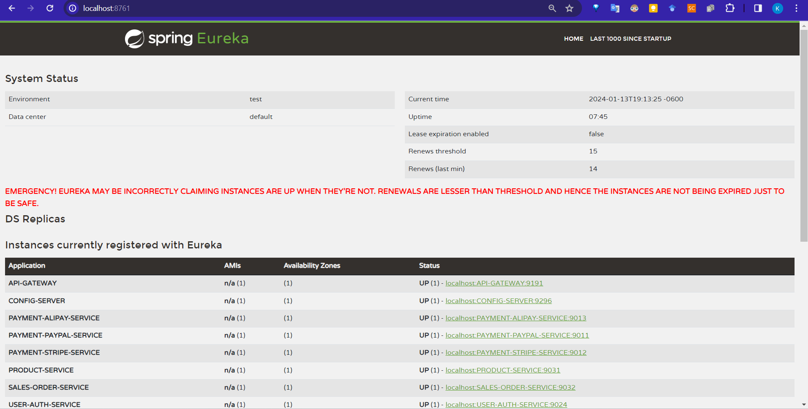

# Payment GateWay Service

## Eureka Payment Gateway


## Refer
[1] https://github.com/coco2023/QuickMall-eCommerce/tree/main/3%20EcommerceBackend

[2] ChatGPT

[3] https://github.com/hello-java-maker/sihai-maven-ssm-alipay

[4] ChatGPT支付宝: https://chat.openai.com/share/259f0ced-2582-4bb8-a36c-32fa7ae5f894

[5] 支付宝: https://opendocs.alipay.com/open/270/105899?pathHash=d57664bf

[6] 支付宝: https://global.alipay.com/docs/ac/ams/oc

[7] 支付宝: https://opendocs.alipay.com/open/59da99d0_alipay.trade.page.pay?scene=22&pathHash=8e24911d#%E4%B8%9A%E5%8A%A1%E5%93%8D%E5%BA%94%E5%8F%82%E6%95%B0


## 支付宝支付页面


## Archi

```md
payment-springboot/                          # Root Directory of the project
│
├── pom.xml                                  # Parent POM file
│
├── common/                                  # Common module (if needed)
│   ├── src/
│   │   ├── main/
│   │   │   ├── java/com/payment/common/     # Java source files for common utilities
│   │   │   │   ├── model/                   # Common entity and model classes
│   │   │   │   └── util/                    # Utility classes
│   │   │   └── resources/                   # Resources for common utilities
│   └── pom.xml                              # POM file for common module
│
├── paypal/                                  # PayPal module
│   ├── src/
│   │   ├── main/
│   │   │   ├── java/com/payment/paypal/
│   │   │   │   ├── controller/
│   │   │   │   ├── service/
│   │   │   │   ├── model/                   # PayPal-specific entities and models
│   │   │   │   └── repository/
│   │   │   └── resources/
│   │   └── test/
│   └── pom.xml
│
├── stripe/                                  # Stripe module
│   ├── src/
│   │   ├── main/
│   │   │   ├── java/com/payment/stripe/
│   │   │   │   ├── controller/
│   │   │   │   ├── service/
│   │   │   │   ├── model/                   # Stripe-specific entities and models
│   │   │   │   └── repository/
│   │   │   └── resources/
│   │   └── test/
│   └── pom.xml
│
├── alipay/                                  # AliPay module
│   ├── src/
│   │   ├── main/
│   │   │   ├── java/com/payment/alipay/
│   │   │   │   ├── controller/
│   │   │   │   ├── service/
│   │   │   │   ├── model/                   # AliPay-specific entities and models
│   │   │   │   └── repository/
│   │   │   └── resources/
│   │   └── test/
│   └── pom.xml
│
└── wechatpay/                               # WeChat Pay module
    ├── src/
    │   ├── main/
    │   │   ├── java/com/payment/wechatpay/
    │   │   │   ├── controller/
    │   │   │   ├── service/
    │   │   │   ├── model/                   # WeChat Pay-specific entities and models
    │   │   │   └── repository/
    │   │   └── resources/
    │   └── test/
    └── pom.xml

```

# MySQL
Certainly! Here are the MySQL CREATE TABLE statements based on the database design we discussed. This script will create tables for users, transactions, payment methods, transaction logs, and user payment details.

```sql
-- Users Table
CREATE TABLE `users` (
    `user_id` INT NOT NULL AUTO_INCREMENT,
    `username` VARCHAR(50) NOT NULL,
    `email` VARCHAR(100) NOT NULL UNIQUE,
    `password_hash` VARCHAR(255) NOT NULL,
    `created_at` DATETIME NOT NULL,
    `updated_at` DATETIME NOT NULL,
    PRIMARY KEY (`user_id`)
);

-- Transactions Table
CREATE TABLE `transactions` (
    `transaction_id` INT NOT NULL AUTO_INCREMENT,
    `user_id` INT NOT NULL,
    `amount` DECIMAL(10, 2) NOT NULL,
    `currency` VARCHAR(10) NOT NULL,
    `status` VARCHAR(20) NOT NULL,
    `payment_method` VARCHAR(50) NOT NULL,
    `created_at` DATETIME NOT NULL,
    `updated_at` DATETIME NOT NULL,
    PRIMARY KEY (`transaction_id`),
    FOREIGN KEY (`user_id`) REFERENCES `users`(`user_id`)
);

-- Payment Methods Table
CREATE TABLE `payment_methods` (
    `method_id` INT NOT NULL AUTO_INCREMENT,
    `method_name` VARCHAR(50) NOT NULL,
    `details` TEXT,
    PRIMARY KEY (`method_id`)
);

-- Transaction Logs Table
CREATE TABLE `transaction_logs` (
    `log_id` INT NOT NULL AUTO_INCREMENT,
    `transaction_id` INT NOT NULL,
    `action` VARCHAR(50) NOT NULL,
    `timestamp` DATETIME NOT NULL,
    `details` TEXT,
    PRIMARY KEY (`log_id`),
    FOREIGN KEY (`transaction_id`) REFERENCES `transactions`(`transaction_id`)
);

-- User Payment Details Table
CREATE TABLE `user_payment_details` (
    `detail_id` INT NOT NULL AUTO_INCREMENT,
    `user_id` INT NOT NULL,
    `method_id` INT NOT NULL,
    `details` TEXT,
    PRIMARY KEY (`detail_id`),
    FOREIGN KEY (`user_id`) REFERENCES `users`(`user_id`),
    FOREIGN KEY (`method_id`) REFERENCES `payment_methods`(`method_id`)
);
```

### Notes:
1. **Data Types and Sizes**: Adjust the VARCHAR and DECIMAL sizes according to your specific needs.
2. **Timestamps**: Ensure that the application or database automatically populates the `created_at` and `updated_at` fields.
3. **Security**: For `password_hash`, ensure that your application logic includes secure hashing of passwords.
4. **Indexing**: Depending on your query patterns, you might want to add indexes to frequently queried columns for performance optimization.
5. **Foreign Keys**: The foreign key relationships ensure referential integrity. Make sure the referenced tables and columns exist before creating these relationships.

This script provides a solid foundation, but be prepared to refine the schema as your application's requirements evolve.


# Designing a Payment API Gateway
Designing a Payment API Gateway requires a strategic approach to handle various aspects like routing requests, managing security, and ensuring scalability. Here's a step-by-step guide to designing an effective Payment API Gateway:

### 1. **Defining the Role and Responsibilities**
- **Central Access Point**: The gateway serves as the sole access point for all payment-related requests from your clients.
- **Request Routing**: It routes requests to the appropriate payment service (PayPal, Stripe, AliPay, WeChat Pay) based on the request parameters.
- **Abstraction Layer**: Provides a uniform interface to clients, abstracting the complexities of interacting with different payment APIs.

### 2. **Architectural Design**
- **Microservices Architecture**: Adopt a microservices architecture to allow each payment service to operate independently.
- **Containerization**: Use technologies like Docker to containerize each service for easier deployment and scalability.
- **API Gateway Pattern**: Implement the API Gateway pattern, which acts as a reverse proxy, routing requests to appropriate microservices.

### 3. **Load Balancing**
- **Purpose**: Distribute incoming traffic among different server instances to avoid overloading a single server.
- **Implementation**: Use load balancers like NGINX or AWS Elastic Load Balancing.

### 4. **Security Measures**
- **Authentication**: Implement secure authentication (like OAuth) to verify the identity of clients.
- **API Rate Limiting**: Prevent abuse and ensure fair usage by limiting the number of requests a client can make in a given time frame.
- **Data Encryption**: Encrypt data in transit using SSL/TLS protocols.
- **Input Validation**: Protect against common security threats like SQL injection and cross-site scripting (XSS) by validating inputs.

### 5. **Unified API Interface**
- **Standardized API Calls**: Design a standardized set of API endpoints for payment operations like initiating a payment, checking transaction status, etc.
- **Request and Response Transformation**: Transform requests and responses to and from the format expected by each specific payment provider.

### 6. **Scalability**
- **Stateless Design**: Ensure the API Gateway is stateless, allowing it to scale horizontally as demand increases.
- **Dynamic Scaling**: Use cloud services that offer automatic scaling based on traffic.

### 7. **Error Handling and Logging**
- **Consistent Error Responses**: Implement consistent error handling and return standardized error messages to clients.
- **Logging**: Log requests and responses for debugging and audit purposes.

### 8. **Monitoring and Health Checks**
- **Real-time Monitoring**: Monitor the health and performance of the API Gateway and underlying services.
- **Alerting System**: Set up an alerting system for any anomalies or failures.

### 9. **Documentation and Developer Support**
- **API Documentation**: Provide comprehensive API documentation for developers.
- **SDKs and Libraries**: Offer SDKs or libraries for popular programming languages to simplify integration for your clients.

### 10. **Testing and Quality Assurance**
- **Automated Testing**: Develop automated tests to cover various scenarios including load testing and security testing.
- **Continuous Integration/Deployment**: Implement CI/CD pipelines for regular updates and easy deployment.

### Technologies to Consider
- **API Management Tools**: Tools like Kong, Apigee, or AWS API Gateway.
- **Cloud Providers**: AWS, Azure, or Google Cloud for hosting and scaling services.
- **Monitoring Tools**: Prometheus, Grafana, or New Relic for monitoring.

This design ensures that your Payment API Gateway is efficient, secure, scalable, and developer-friendly. Remember, the specific technologies and tools you choose should align with your project's scale, budget, and expertise.


# Design Step
Designing the system architecture for a multi-payment gateway service involves creating a scalable, secure, and maintainable structure. Here's a detailed approach to designing such an architecture:

### 1. **High-Level Overview**
- **Purpose**: Understand that the architecture's goal is to facilitate easy, secure, and efficient transactions using multiple payment methods.
- **Key Components**: Identify core components like the API Gateway, Payment Service Modules, Database, User Interface, and Security Infrastructure.

### 2. **API Gateway**
- **Role**: Acts as the entry point for all client requests, directing them to the appropriate payment service module.
- **Load Balancing**: Implement load balancing to efficiently manage traffic.
- **Security**: Integrate security measures like API rate limiting and request authentication.

### 3. **Payment Service Modules**
- **Modular Design**: Create separate modules for PayPal, Stripe, AliPay, and WeChat Pay.
- **Isolation**: Ensure that each module operates independently, so issues in one do not affect others.
- **Integration Points**: Define clear APIs for each module to interact with the rest of the system.

### 4. **Unified Interface**
- **Abstraction Layer**: Develop a unified interface that abstracts the complexities of individual payment service APIs.
- **Consistent API**: Offer a consistent API for your clients regardless of the underlying payment service used.

### 5. **Database Design**
- **Storage**: Decide on a database schema that can store transaction data, user information, and logs.
- **Scalability**: Ensure the database is scalable and can handle growing transaction volumes.
- **Backup and Recovery**: Plan for regular backups and robust recovery strategies.

### 6. **User Interface (UI)**
- **Checkout Flow**: Design a UI that presents payment options clearly and guides users through the checkout process.
- **Responsiveness**: Ensure the UI is responsive and works across different devices.

### 7. **Security Infrastructure**
- **Data Encryption**: Implement encryption for data at rest and in transit.
- **Authentication and Authorization**: Secure access to the system with strong authentication and authorization mechanisms.
- **Compliance**: Ensure that the architecture complies with relevant financial and data protection regulations.

### 8. **Backend Services**
- **Business Logic**: Implement business logic for processing transactions, handling errors, and managing user accounts.
- **Service Communication**: Use secure and efficient protocols for internal communication between services.

### 9. **Monitoring and Logging**
- **Real-time Monitoring**: Set up real-time monitoring for system performance and health.
- **Logging**: Implement comprehensive logging for debugging and tracking transactions.

### 10. **Scalability and Redundancy**
- **Horizontal Scaling**: Design the system to allow horizontal scaling to handle increased loads.
- **Failover Mechanisms**: Implement failover mechanisms for high availability.

### 11. **Deployment Strategy**
- **Containerization**: Consider using containerization (e.g., Docker) for easy deployment and scalability.
- **Continuous Integration/Continuous Deployment (CI/CD)**: Establish CI/CD pipelines for smooth deployment.

### 12. **Testing and Quality Assurance**
- **Automated Testing**: Implement automated testing for each component and the system as a whole.
- **Performance Testing**: Regularly conduct performance and stress tests.

### Best Practices:
- **Keep Updated**: Regularly update the modules to comply with the latest API changes from payment providers.
- **Documentation**: Maintain thorough documentation for each component and their interactions.
- **User-Centric Design**: Focus on creating an intuitive and seamless experience for the end-users.

This architecture serves as a robust foundation for a multi-payment gateway service, balancing efficiency, security, and user experience. Remember, the specifics can vary based on your exact requirements and constraints.

# Design 2
Designing a payment gateway service that integrates multiple providers like PayPal, Stripe, AliPay, and WeChat Pay is a substantial project, but it's definitely achievable with careful planning and execution. Here's a high-level guide to help you get started:

### 1. **Understand Compliance and Security Standards**
- **PCI DSS Compliance**: Ensure your system adheres to the Payment Card Industry Data Security Standard (PCI DSS).
- **Data Security**: Implement strong encryption for data transmission and storage.
- **Fraud Prevention**: Plan for fraud detection and prevention mechanisms.

### 2. **Choose Your Technology Stack**
- **Backend Language**: Consider languages like Python, Java, or Node.js.
- **Database**: SQL or NoSQL depending on your needs (e.g., MySQL, PostgreSQL, MongoDB).
- **Frontend**: HTML/CSS/JavaScript with frameworks like React or Angular for a dynamic UI.

### 3. **Understand Each Payment Method**
- **Documentation Review**: Thoroughly read the API documentation for PayPal, Stripe, AliPay, and WeChat Pay.
- **Integration Capabilities**: Note their integration capabilities, supported currencies, transaction fees, and geographic limitations.

### 4. **Design Your System Architecture**
- **Modular Design**: Create a modular architecture where each payment method is a separate module. This makes it easier to maintain and update.
- **API Gateway**: Implement an API Gateway to manage requests and direct them to the appropriate payment service.
- **Unified API**: Design a unified API on your end that your clients can integrate, abstracting away the complexity of individual payment services.

### 5. **Implement User Interface**
- **Checkout Page**: Design a user-friendly checkout page.
- **Payment Options**: Allow users to choose their preferred payment method.
- **Mobile Responsiveness**: Ensure the UI is mobile-friendly.

### 6. **Develop Backend Logic**
- **Transaction Processing**: Handle the logic for processing transactions, including error handling.
- **Currency Conversion**: If operating internationally, handle currency conversion.
- **Notifications**: Implement notifications for transaction status.

### 7. **Integrate with Payment Services**
- **API Integration**: Use the APIs provided by PayPal, Stripe, AliPay, and WeChat Pay for integration.
- **Testing**: Rigorously test each payment method integration.

### 8. **Implement Security Measures**
- **SSL/TLS Encryption**: Ensure all data transmissions are encrypted.
- **Input Validation**: Prevent SQL injection and other attacks through strict input validation.
- **Regular Audits**: Plan for regular security audits.

### 9. **Testing and Quality Assurance**
- **Unit Testing**: Write unit tests for each component.
- **Integration Testing**: Test the integration between different components and payment methods.
- **Load Testing**: Ensure the system can handle high traffic.

### 10. **Compliance and Legal Requirements**
- **Legal Consultation**: Consult with a legal expert to understand the regulatory requirements in different regions.
- **User Agreements and Privacy Policies**: Draft clear user agreements and privacy policies.

### 11. **Deployment and Monitoring**
- **Deployment**: Use a reliable cloud service provider for deployment.
- **Monitoring Tools**: Implement monitoring tools to track system performance and uptime.
- **Support and Maintenance**: Set up a system for ongoing support and maintenance.

### 12. **Documentation and User Support**
- **Developer Documentation**: Provide clear documentation for developers who will integrate with your payment gateway.
- **Customer Support**: Set up customer support channels for end-users.

### Additional Considerations:
- **User Experience**: Focus on creating a seamless and intuitive user experience.
- **Scalability**: Design the system to be scalable as your user base grows.
- **Local Regulations**: Be mindful of the local regulations in markets you serve, especially concerning financial transactions.

Remember, this is a complex project requiring a significant amount of technical expertise, especially in security and financial regulations. It might be wise to consult with or even hire experts in areas where your team lacks expertise.

# DB
Designing a database schema for a payment gateway service using MySQL, with a backend in Spring Boot, involves creating tables that can efficiently store and manage transaction data, user information, and other relevant details. Here's a conceptual design for such a database:

### Database Schema Overview

#### 1. **Users Table**
- **Table Name**: `users`
- **Description**: Stores user account information.
- **Columns**:
    - `user_id` (Primary Key, INT, Auto Increment)
    - `username` (VARCHAR)
    - `email` (VARCHAR, Unique)
    - `password_hash` (VARCHAR)
    - `created_at` (DATETIME)
    - `updated_at` (DATETIME)

#### 2. **Transactions Table**
- **Table Name**: `transactions`
- **Description**: Records details of each transaction.
- **Columns**:
    - `transaction_id` (Primary Key, INT, Auto Increment)
    - `user_id` (INT, Foreign Key to `users.user_id`)
    - `amount` (DECIMAL)
    - `currency` (VARCHAR)
    - `status` (VARCHAR) - e.g., 'pending', 'completed', 'failed'
    - `payment_method` (VARCHAR) - e.g., 'PayPal', 'Stripe', etc.
    - `created_at` (DATETIME)
    - `updated_at` (DATETIME)

#### 3. **Payment Methods Table**
- **Table Name**: `payment_methods`
- **Description**: Stores information about the available payment methods.
- **Columns**:
    - `method_id` (Primary Key, INT, Auto Increment)
    - `method_name` (VARCHAR) - e.g., 'PayPal', 'Stripe'
    - `details` (TEXT) - JSON or similar format to store API keys or other configuration

#### 4. **Transaction Logs Table**
- **Table Name**: `transaction_logs`
- **Description**: Logs all transaction activities for auditing.
- **Columns**:
    - `log_id` (Primary Key, INT, Auto Increment)
    - `transaction_id` (INT, Foreign Key to `transactions.transaction_id`)
    - `action` (VARCHAR) - e.g., 'created', 'updated', 'status_change'
    - `timestamp` (DATETIME)
    - `details` (TEXT) - JSON or similar format to store additional log details

#### 5. **User Payment Details Table**
- **Table Name**: `user_payment_details`
- **Description**: Stores user-specific payment details.
- **Columns**:
    - `detail_id` (Primary Key, INT, Auto Increment)
    - `user_id` (INT, Foreign Key to `users.user_id`)
    - `method_id` (INT, Foreign Key to `payment_methods.method_id`)
    - `details` (TEXT) - e.g., tokenized payment information

### Database Design Considerations

- **Normalization**: The schema is normalized to reduce data redundancy and improve data integrity.
- **Indexes**: Create indexes on frequently queried fields (e.g., `user_id`, `transaction_id`) for faster query execution.
- **Foreign Key Constraints**: Enforce foreign key constraints for data integrity between related tables.
- **Security**: Store sensitive information like passwords and payment details securely. For instance, use hashing for passwords and consider tokenization or encryption for payment details.
- **Timestamps**: Including `created_at` and `updated_at` timestamps in your tables is useful for tracking changes and for audit purposes.

### Integration with Spring Boot

- **JPA/Hibernate**: Use Spring Boot's JPA (Java Persistence API) with Hibernate for ORM (Object-Relational Mapping) to interact with the MySQL database.
- **Repository Pattern**: Implement the repository pattern for data access, separating the business logic from the data access layer.
- **Transactions**: Utilize Spring's `@Transactional` annotation to handle transactions smoothly.

This schema serves as a foundational structure for your payment gateway service. It's scalable and adaptable to future requirements. You might need to adjust it based on your specific business needs and scale.

# Git
The issue you're facing suggests that the `payment-service_framework.zip` file was not successfully removed from the commit history during the rebase process. The error `fatal: pathspec 'payment-service_framework.zip' did not match any files` indicates that Git did not find the file in the current state of the repository during the rebase, which is expected if the file was added in a previous commit.

Here's an alternative approach using `git filter-branch`, which is a powerful tool for rewriting history. It can be used to remove files from the entire history of a branch.

1. **Remove the File from All Commits**:
  - Run the following command to remove `payment-service_framework.zip` from all commits:
    ```bash
    git filter-branch --force --index-filter "git rm --cached --ignore-unmatch payment-service_framework.zip" --prune-empty --tag-name-filter cat -- --all
    ```

2. **Force Push the Changes**:
  - After successfully removing the file from all commits, force push your changes to the remote repository:
    ```bash
    git push origin main --force
    ```

This command will go through your commit history and remove the specified file from all commits. The `--ignore-unmatch` flag is used to avoid errors in commits where the file doesn't exist.

**Important Note**: `git filter-branch` is a very powerful command that rewrites history. It can have significant implications, especially if you're working in a shared repository. Ensure you have a backup of your repository before running this command. Also, inform any collaborators about this change, as they will need to rebase any work based on the old history.

After running these commands, the large file should be removed from your history, and you should be able to push your changes to GitHub.


